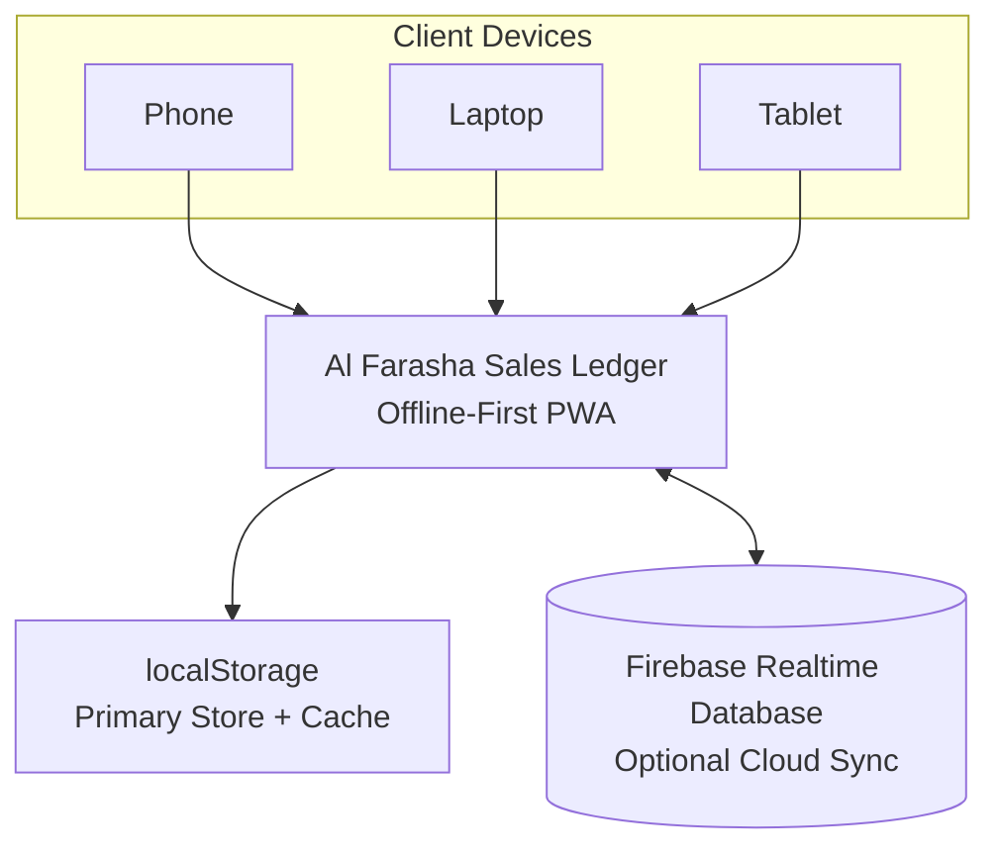
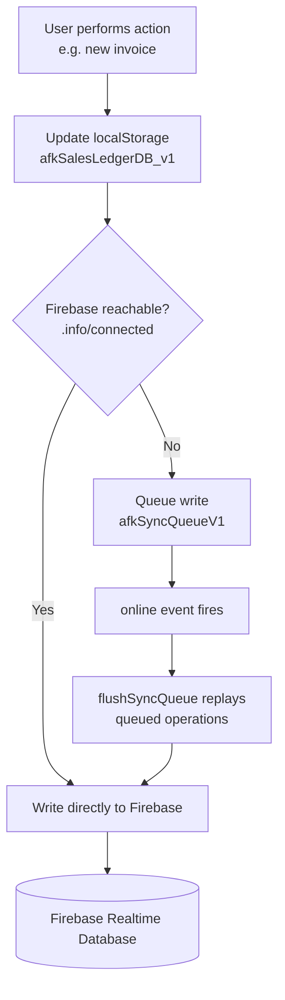

# Al Farasha Al Khadhra — Sales Ledger

A self-contained, offline-first Progressive Web App for sales and credit-ledger management, built for a building materials trading company in Sharjah, UAE.

## Overview

Al Farasha Sales Ledger manages the full sales side of a **dispatch-and-shop hybrid** business — salesmen carrying goods out for delivery, alongside walk-in retail sales. The entire app is a single HTML file: no backend server, no build step, no npm install. Open it in a browser and it works; installed as a PWA, it behaves like a native app on phone or desktop.

## Features

- Customer accounts with credit ledgers and credit limits
- Sales invoices with optional 5% VAT
- Payment collection tracking
- Daily dispatch (van loading / stock tracking)
- Bilingual (English/Urdu) customer account statements
- Overdue-account and credit-limit notifications
- Global search across customers, invoices, and payments
- App lock (PIN + biometric)
- Local backup & restore
- Invoice print / PDF preview

## Tech Stack

- **Core:** Pure HTML5, CSS3, vanilla JavaScript — no frameworks, no build tools
- **Sync/backend:** Firebase Realtime Database (optional — the app runs fully offline without it)
- **Storage:** `localStorage` as the primary data store and offline cache
- **PDF export:** jsPDF + jsPDF-AutoTable
- **PWA:** Service worker, manifest, installable on mobile and desktop

## Architecture

### System Architecture

### Offline Sync Flow

One deliberate design decision worth knowing: dispatch quantities sold (`qtySold`) are recalculated from invoices on every load rather than stored and synced — an earlier version stored this value directly, which let a stale offline-queued write silently overwrite a newer one after reconnect. See [`docs/DOCUMENTATION.md`](docs/DOCUMENTATION.md) for the full writeup.

See [`docs/DOCUMENTATION.md`](docs/DOCUMENTATION.md) for the full data architecture, Firebase sync model, and offline-write flow.

## Documentation

Full technical and feature documentation (data models, every screen, print system, security notes, known design decisions): [`docs/DOCUMENTATION.md`](docs/DOCUMENTATION.md)
